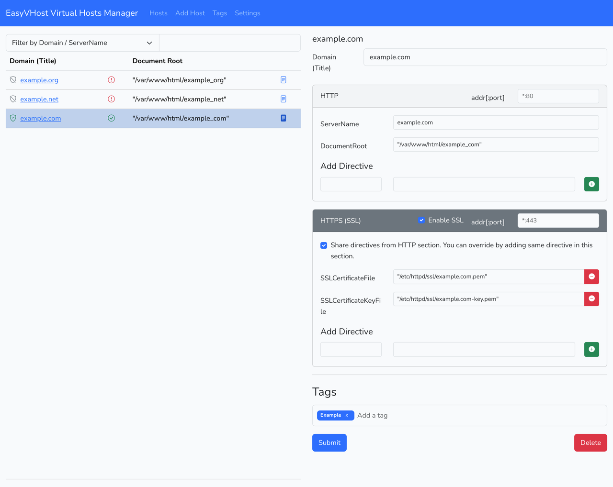
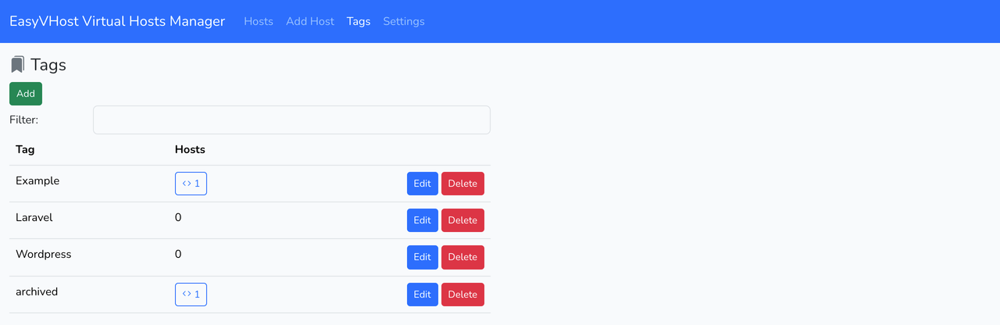
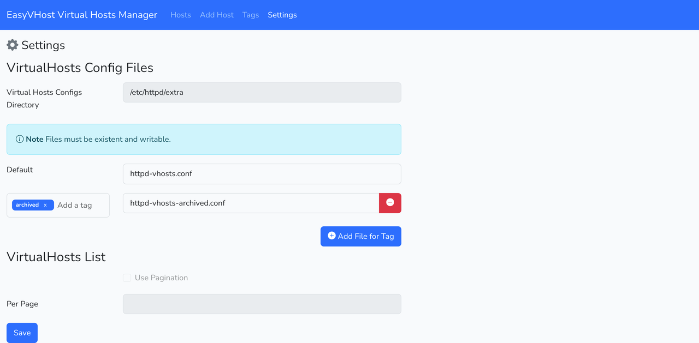

# EasyVHost

Apache Virtual Hosts manager with the following features:

- Manage hosts using a web browser.
- Save hosts to database.
- Predefined directives.
- Use tags for hosts.
- Easily search hosts.
- Setting for virtual host file path with support to define a file per tag.

[](https://github.com/wesamly/easyvhost/actions)

[](https://opensource.org/licenses/MIT)

**Screenshots**

<div style="display:grid; grid-template-columns: 1fr 1fr 1fr; gap:10px;">
    
    
    
</div>

**Technology**

Laravel PHP Framework, with Vue 3 for frontend, and MySQL/SQLite Database.

**Status**

Beta

> **Warning**
> Work in progress, always backup your virtual host config files.

## Dependencies

- PHP >= 8.2 (For detailed extensions check [Laravel 11 Deployment](https://laravel.com/docs/11.x/deployment#server-requirements))
- Apache Web Server
- MySQL 5.7+, MariaDB 10.3+, or SQLite 3.26.0+
- Node.js (16+)

## Installation

Use `git clone` or download files, then run the following commands:

```bash
composer install
cp .env.example .env
php artisan key:generate --ansi
```

### Database

#### MySQL

Create a database using your database manager, e.g. phpMyAdmin.

In `.env` file update database variables:

```.env
DB_DATABASE=evhost_db
DB_USERNAME=root
DB_PASSWORD=
```
#### SQLite

Create file `database.sqlite` under */database*

In `.env` file update database variables:

```.env
DB_CONNECTION=sqlite
DB_DATABASE=/absolute/path/easyvhost/database/database.sqlite
```

Run the following command to create database tables:

```php artisan migrate```

### Frontend

Run the following commands:

```bash
npm install
npm run dev
```
#### Deployment

```bash
npm run build
```
### Enable Desktop Integration (Optional)

To allow EasyVHost to open folders on your computer, follow the [Protocol Setup Guide](docs/protocol_setup.md).

## Virtual Host Modifiers

Check [documentation](modifiers/README.md).

## Accessing the EasyVHost Application

After cloning or copying the EasyVHost application to your desired installation directory (`install_dir`), you can access it using one of the following methods:

**1. Accessing via `localhost`**

* **Prerequisites:**
    * A web server (e.g., Apache, Nginx) running on your local machine.
    * The EasyVHost application files copied into the web server's document root (typically `www` or `htdocs`).
* **Steps:**
    1.  Copy the EasyVHost application files into your web server's document root.
    2.  Open your web browser and navigate to: `http://localhost/easyvhost/public`

**2. Accessing via Virtual Host**

* **Prerequisites:**
    * Apache web server installed and configured.
    * Ability to modify Apache's virtual host configuration.
* **Steps:**
    1.  Create an Apache virtual host configuration that points to the `public` directory of your EasyVHost application.
        * Example (Apache):

            ```apacheconf
            <VirtualHost *:80>
                ServerName easyvhost.test
                DocumentRoot "install_dir/public"
            </VirtualHost>
            ```

    2.  Add `easyvhost.test` to your system's hosts file (`/etc/hosts` on Linux/macOS, `C:\Windows\System32\drivers\etc\hosts` on Windows).
        * Example: `127.0.0.1 easyvhost.test`
    3.  Restart Apache.
    4.  Open your web browser and navigate to: `http://easyvhost.test`

**3. Accessing via `php artisan serve`**

* **Steps:**
    1.  Open your terminal or command prompt.
    2.  Navigate to the EasyVHost application's root directory (`install_dir`).
    3.  Run the command: `php artisan serve`
    4.  Open your web browser and navigate to the URL displayed in the terminal (usually `http://127.0.0.1:8000`).

## Getting help

If you have questions, concerns, bug reports, etc, please file an issue in this repository's Issue Tracker.

## License

EasyVHost is released under the [MIT License](https://opensource.org/licenses/MIT).